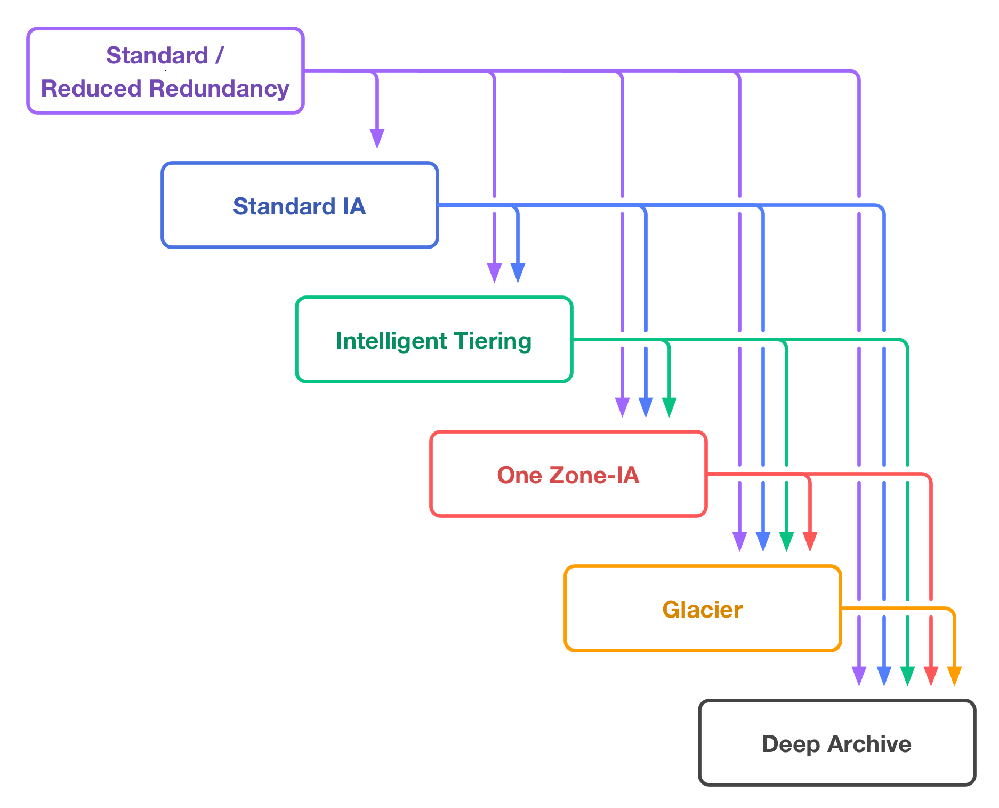
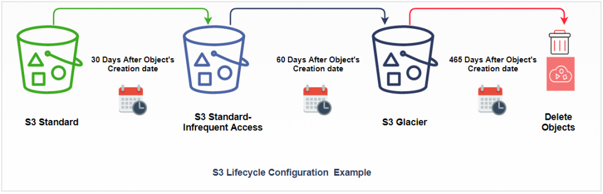
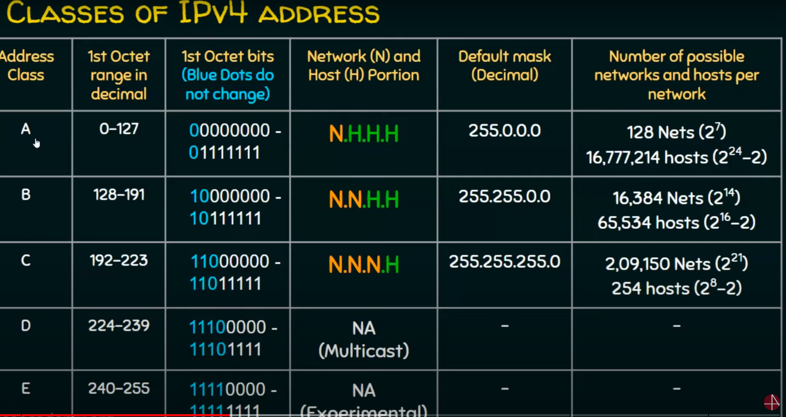
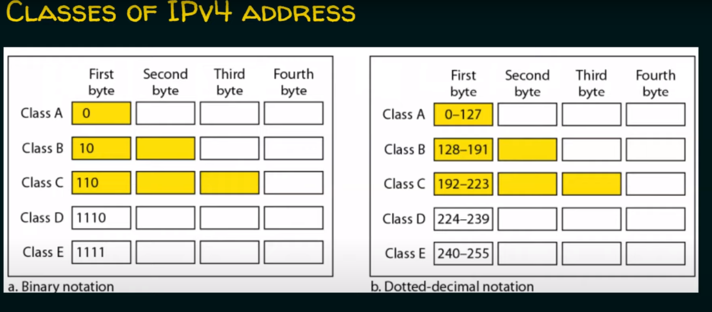
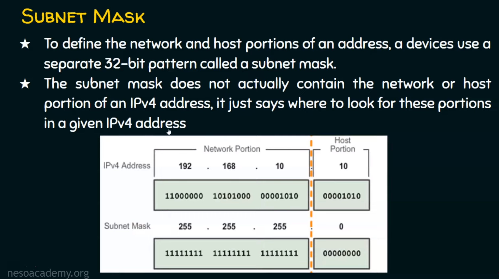
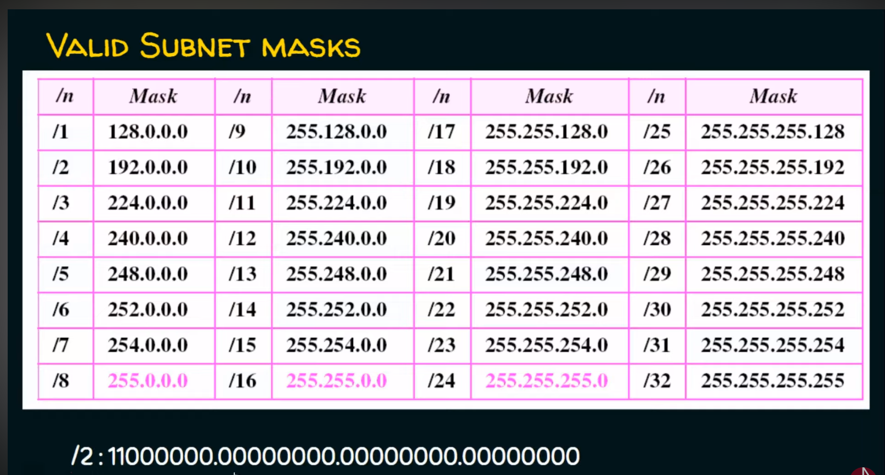

# Cloud Computing
- Cloud Computing refers to the delivery of computing resources, such as servers, storage, databases, networking, and software, over the Internet.
- It provides on-demand access to scalable and flexible resources, allowing users to pay only for what they use.
- Cloud Computing offers benefits like cost savings, scalability, reliability, and global availability.

# AWS (Amazon Web Services)
- AWS is a cloud computing platform provided by Amazon.
- It offers a broad range of cloud services, including computing power, storage, databases, analytics, machine learning, and more.
- AWS provides a reliable and secure infrastructure for building and deploying applications and services.

# AWS S3 (Simple Storage Service)
- AWS S3 is a scalable object storage service provided by AWS.
- It allows you to store and retrieve large amounts of data, such as documents, images, videos, and backups.
- S3 provides high durability, availability, and performance for storing and retrieving objects.

# Benefits of AWS S3
- Scalability: S3 can handle any amount of data and scale to support growing storage needs.
- Durability: S3 stores multiple copies of objects across multiple facilities, ensuring high durability and data resilience.
- Availability: S3 provides high availability, allowing you to access your data from anywhere at any time.
- Cost-Effective: S3 offers cost-effective storage options with flexible pricing based on data usage and storage class.
- Security: S3 provides built-in security features like encryption, access control, and monitoring to protect your data.

# Objects and Buckets in AWS S3
- Objects: In S3, data is stored as objects. An object consists of the data itself, a key (unique identifier), and metadata.
- Buckets: S3 uses buckets to organize and store objects. A bucket is a container for objects and must have a globally unique name.

# How does AWS S3 work?
- To store data in S3, you create a bucket and upload objects to it using the AWS Management Console, API, or SDKs.
- Each object is stored with a unique key, and you can set permissions and access policies to control object-level access.
- S3 provides high-speed access to objects, and you can retrieve them using unique URLs or integrate S3 with other AWS services.

# Features of AWS S3
- Versioning: S3 allows you to version objects, enabling you to preserve, retrieve, and restore previous versions.
- Lifecycle Management: S3 supports lifecycle rules to automate object transitions and expiration based on defined criteria.
- Event Notifications: S3 can trigger event notifications (e.g., object creation, deletion) to other AWS services or external systems.
- Access Control: S3 provides fine-grained access control using AWS Identity and Access Management (IAM) and bucket policies.
- Encryption: S3 offers server-side encryption to protect data at rest and client-side encryption for added security.

# S3 lifecycle management 

# AWS RDS Notes

## Overview
- Amazon RDS is a managed database service provided by AWS.
- It simplifies the process of setting up, operating, and scaling a relational database in the cloud.
- RDS supports various database engines like Amazon Aurora, PostgreSQL, MySQL, MariaDB, Oracle Database, and Microsoft SQL Server.

## Features

### Managed Service
- AWS RDS takes care of time-consuming database administration tasks like backups, software patching, and hardware provisioning.
- It allows you to focus on your application development rather than managing the infrastructure.

### Automated Backups
- RDS provides automated backups of your database.
- You can specify the backup retention period and take manual snapshots as well.
- Point-in-time recovery allows you to restore your database to any specific second within the retention period.

### Scalability
- RDS allows you to easily scale your database resources vertically (by increasing the instance size) or horizontally (by adding read replicas).
- Scaling can be done with minimal downtime or disruption to your application.

### High Availability
- RDS offers Multi-AZ deployments that automatically replicate your database to a standby instance in a different Availability Zone.
- In case of a primary database failure, RDS automatically fails over to the standby instance to minimize downtime.

### Security
- RDS supports various security features such as network isolation, encryption at rest, and encryption in transit.
- You can use AWS Identity and Access Management (IAM) to manage database access control.

### Monitoring and Metrics
- RDS integrates with AWS CloudWatch to provide monitoring and metrics for your database.
- You can set up alarms and receive notifications for events like high CPU usage, low storage space, or replication lag.

### Database Engine Options
- RDS supports multiple database engines, each with its own specific features and compatibility.
- You can choose the engine that best suits your application requirements.

### Compatibility
- RDS is compatible with existing MySQL, PostgreSQL, Oracle, and SQL Server applications, making it easy to migrate your on-premises databases to the cloud.

## Use Cases
- Hosting web applications or e-commerce platforms that require a reliable and scalable database backend.
- Running enterprise applications that rely on popular database engines like Oracle or SQL Server.
- Development and testing environments that require quick provisioning and easy management of databases.

*[AWS]: Amazon Web Services
*[RDS]: Relational Database Service
*[AZ]: Availability Zone
*[IAM]: Identity and Access Management
*[CPU]: Central Processing Unit

Differences between AWS EC2 (Elastic Compute Cloud) and AWS RDS (Relational Database Service) in terms of their managed features:

| Features       | AWS EC2 (Managed)                                            | AWS RDS (Managed)                                            |
| -------------- | ------------------------------------------------------------ | ------------------------------------------------------------ |
| Deployment     | You provision and manage virtual machines (EC2 instances) yourself. | AWS RDS manages the database infrastructure, including provisioning and scaling. |
| Database Setup | You need to install and configure the database software on EC2 instances. | AWS RDS provides pre-configured and ready-to-use database engines. |
| Backup         | You are responsible for setting up and managing your own database backups. | AWS RDS offers automated backups and allows you to set backup retention periods. |
| Patching       | You are responsible for patching and updating the operating system and database software on EC2 instances. | AWS RDS handles patching and updates for the database software. |
| High Availability | You need to set up and manage your own high availability solution, such as using multiple EC2 instances and load balancers. | AWS RDS provides Multi-AZ deployments that automatically replicate data to standby instances in different Availability Zones. |
| Scalability    | You can manually scale up or down the EC2 instances to meet your application's needs. | AWS RDS offers vertical scaling (increasing instance size) and horizontal scaling (adding read replicas) with minimal downtime. |
| Monitoring     | You need to set up and configure monitoring tools for EC2 instances. | AWS RDS integrates with AWS CloudWatch for monitoring database metrics and events. |
| Database Administration | You have full control over the database administration tasks, such as creating users, managing security, and optimizing performance. | AWS RDS automates many database administration tasks, such as backups, software patching, and hardware provisioning. |
| Database Engines | You can choose from a wide range of supported operating systems and can install various database engines on EC2 instances. | AWS RDS provides pre-configured database engines like Amazon Aurora, PostgreSQL, MySQL, MariaDB, Oracle, and SQL Server. |
| Compatibility   | EC2 instances can be used to host any software or application, including non-relational databases and other services. | RDS is designed specifically for managing relational databases, providing optimized performance and compatibility with popular database engines. |

## Launch Configurations and Auto Scaling Groups

**Launch Configurations**:
- Launch Configurations define the configuration parameters for instances launched by an Auto Scaling Group.
- They include specifications like AMI ID, instance type, security groups, user data, etc.
- Launch Configurations ensure consistent and repeatable instance creation within an Auto Scaling Group.

**Auto Scaling Groups**:
- Auto Scaling Groups manage a group of EC2 instances collectively.
- They automatically adjust the number of instances based on changes in demand.
- Auto Scaling Groups ensure optimal performance, availability, and cost efficiency.

**Creating an Auto Scaling Group**:
1. **Create a Launch Configuration**:
   - Define configuration parameters for instances.
   - Specify AMI, instance type, security groups, and user data.
   - Create the Launch Configuration.

2. **Create an Auto Scaling Group**:
   - Select the Launch Configuration.
   - Set desired capacity, minimum and maximum limits, and health check options.
   - Configure scaling policies based on metrics like CPU utilization or network traffic.
   - Review and create the Auto Scaling Group.

3. **Configure Additional Settings**:
   - Customize notifications, scaling cooldown periods, lifecycle hooks, and instance termination policies.
   - Fine-tune the behavior and scaling behavior of the Auto Scaling Group.

By utilizing Launch Configurations and Auto Scaling Groups, you can achieve seamless scaling of your workload, handle fluctuations in demand, and optimize cost while maintaining high availability.

---

# Elastic Load Balancing (ELB) and Target Groups

## Elastic Load Balancing (ELB)
- Elastic Load Balancing is a service provided by AWS that automatically distributes incoming application traffic across multiple targets, such as EC2 instances or containers, to ensure high availability and scalability.
- ELB acts as a single entry point for clients and distributes traffic across registered targets.
- It helps improve the fault tolerance, scalability, and availability of your applications.

### Key Components of ELB:
1. **Load Balancer**:
   - The Load Balancer is the main component that receives incoming traffic and distributes it across registered targets based on configured rules.
   - There are three types of Load Balancers in AWS: Application Load Balancer (ALB), Network Load Balancer (NLB), and Classic Load Balancer (CLB).

2. **Listeners**:
   - Listeners define the protocol and port on which the Load Balancer listens for incoming traffic.
   - They forward traffic to the appropriate target based on the rules defined in the listener configuration.

3. **Health Checks**:
   - Health Checks monitor the health and availability of registered targets.
   - They periodically check the target's status and route traffic only to healthy targets.

4. **Security Groups**:
   - Security Groups control the inbound and outbound traffic to the Load Balancer.
   - They help enforce network security by specifying the allowed protocols, ports, and source IP ranges.

## Target Groups
- Target Groups are an integral part of Application Load Balancers (ALBs) and Network Load Balancers (NLBs).
- They define a set of targets (EC2 instances or containers) that the Load Balancer distributes traffic to.
- Target Groups enable advanced traffic routing and allow you to associate multiple services or instances with a single Load Balancer.

### Key Components of Target Groups:
1. **Targets**:
   - Targets represent the registered instances or containers that receive traffic from the Load Balancer through the Target Group.
   - They can be EC2 instances, IP addresses, or AWS Lambda functions.

2. **Health Checks**:
   - Similar to ELB health checks, Target Groups perform health checks on their registered targets.
   - Health checks ensure that only healthy targets receive traffic from the Load Balancer.

3. **Attributes and Settings**:
   - Target Groups have various configurable attributes and settings, such as health check configuration, load balancing algorithm, and target port.
   - These settings allow you to fine-tune the behavior and routing behavior of the Target Group.

---

## VPCs, Subnets, Internet Gateways, NAT Gateways, and Route Tables

**VPC (Virtual Private Cloud)**:
- A VPC is a virtual network within the AWS cloud.
- It allows you to provision a logically isolated section of the AWS infrastructure.
- You have control over IP addressing, subnets, routing, and security settings within the VPC.

**Subnets**:
- Subnets are subdivisions of a VPC.
- They define ranges of IP addresses that define network segments.
- Subnets can be either public or private.

**Public Subnets**:
- Public subnets are accessible from the internet.
- They have a route to an Internet Gateway, allowing instances within the subnet to have public IP addresses.
- Public subnets are typically used for resources that require direct internet access, such as web servers.

**Private Subnets**:
- Private subnets are not directly accessible from the internet.
- They do not have a route to an Internet Gateway.
- Instances within private subnets can communicate with each other and with resources in public subnets or the internet through NAT Gateways or other outbound methods.

**Internet Gateway**:
- An Internet Gateway is a horizontally scalable, highly available AWS managed service.
- It allows communication between instances in your VPC and the internet.
- An Internet Gateway provides a target for the default route in a public subnet's route table.

**NAT Gateway (Network Address Translation Gateway)**:
- A NAT Gateway enables instances within private subnets to connect to the internet while preventing inbound connections from the internet.
- It provides outbound internet access for instances without public IP addresses.
- NAT Gateways are highly available, managed by AWS, and scale automatically based on traffic.

**Route Tables**:
- Route Tables control the traffic between subnets within a VPC.
- They define how traffic is routed within the VPC and to external networks.
- Each subnet must be associated with a route table.
- Route tables contain rules (routes) that determine where the traffic is directed.

Sure! Here's a note on the concepts of IP addressing, subnetting, subnet masks, and AWS VPC peering in Markdown format:

# IP Addressing, Subnetting, Subnet Masks, and AWS VPC Peering

## IP Addressing
- An IP (Internet Protocol) address is a unique numerical label assigned to each device connected to a network.
- It allows devices to communicate and identify each other in an IP network.
- IP addresses can be either IPv4 (32-bit) or IPv6 (128-bit) format.

## Subnetting
- Subnetting is the process of dividing a network into smaller subnetworks called subnets.
- It helps in efficient address allocation, security, and network management.
- Subnetting is based on the concept of borrowing bits from the host portion of the IP address to create a subnet ID.

## Subnet Masks
- A subnet mask is a 32-bit value used to divide an IP address into network and host portions.
- It determines the size of the network and the number of available hosts in a subnet.
- Subnet masks are represented in decimal or CIDR notation.

## AWS VPC Peering
- VPC peering is a feature in AWS that allows direct communication between two Virtual Private Clouds (VPCs).
- It enables instances in different VPCs to communicate with each other using private IP addresses.
- VPC peering is secure, scalable, and does not require an internet gateway or a VPN connection.
- Peered VPCs behave as if they are in the same network, allowing seamless connectivity.

### Benefits of VPC Peering
- **Private Communication**: VPC peering ensures secure and private communication between VPCs without traversing the internet.
- **Low Latency**: Communication between peered VPCs has low latency, improving overall performance.
- **Simplified Network Architecture**: VPC peering simplifies network architecture by eliminating the need for complex VPN configurations or NAT gateways.
- **Shared Resources**: Peered VPCs can access and share resources, such as Amazon EC2 instances, RDS databases, or other services.
- **Transitive Peering**: VPC peering supports transitive relationships, allowing communication between VPCs through a hub-and-spoke architecture.

Please note that IP addressing, subnetting, and subnet mask calculations involve more in-depth concepts and calculations. Understanding these concepts thoroughly requires further study and practice.

Feel free to format and enhance the above notes as per your requirements in the Markdown file.