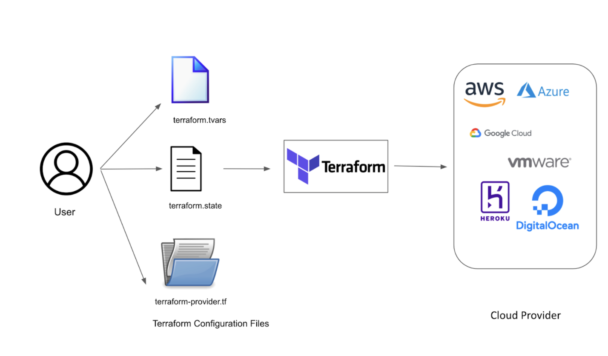

# Introduction to Terraform

Terraform is an infrastructure as code (IaC) tool that allows you to provision and manage infrastructure resources in a declarative manner. With Terraform, you can define your infrastructure requirements using simple and readable configuration files, and Terraform will handle the provisioning and management of those resources.

## Files Used in Terraform

Terraform uses several types of files to define and configure your infrastructure. Here are the main files you'll encounter:

1. **main.tf**: This file is the primary configuration file where you define the resources and their properties that you want to provision. It contains the main Terraform code for creating, updating, and deleting resources.

2. **variables.tf**: This file is used to declare the variables that can be used in your main configuration file. Variables allow you to parameterize your Terraform code, making it more flexible and reusable. You can define the variable type, description, and default values in this file.

3. **backend.tf**: This file is used to configure the backend for storing the Terraform state file. The backend determines where the state file is stored and how it is accessed. It can be a local file, remote storage (such as S3), or a version control system. You specify the backend configuration in this file.

4. **terraform.tfvars**: This file is used to assign specific values to the variables defined in variables.tf. It allows you to customize your Terraform configuration without modifying the main configuration files. You can set values for variables specific to your environment in this file.

5. **output.tf**: This file is used to define the outputs of your Terraform configuration. Outputs allow you to retrieve and display information about the resources created by Terraform. You can define the output variables and their values in this file.

6. **provider.tf**: This file is used to configure the provider for the infrastructure resources you are working with. The provider is responsible for communicating with the API of the target infrastructure platform (e.g., AWS, Azure). You specify the provider configuration, such as access credentials and region, in this file.

7. **versions.tf**: This file is used to specify the required version constraints for Terraform and provider plugins. It ensures that the correct versions of Terraform and the providers are used when running Terraform commands.

## Important Concepts in Terraform

1. **Resources**: Resources are the fundamental building blocks of your infrastructure. They represent the various components (e.g., EC2 instance, VPC, S3 bucket) that you want to create and manage using Terraform. Resources are defined in your main.tf file and typically have properties and attributes that you can configure.

2. **Variables**: Variables allow you to parameterize your Terraform configuration. They provide a way to pass values into your configuration and make it more flexible and reusable. Variables are defined in variables.tf and can have different types (e.g., string, number, list). You can set default values or prompt users for input when using variables.

3. **Data Sources**: Data sources allow you to retrieve information from external systems (e.g., AWS, Azure) and use that information in your Terraform configuration. Data sources provide read-only access to the information and can be used to fetch details about existing resources (e.g., AMIs, subnets) to make informed decisions in your configuration.

4. **Outputs**: Outputs are used to extract and display information about the resources created by Terraform. They allow you to expose useful information (e.g., IP addresses, resource IDs) that can be consumed by other systems or scripts. Outputs are defined in output.tf and can be referenced

 or accessed after Terraform applies the configuration.

5. **Providers**: Providers are responsible for interacting with the APIs of the target infrastructure platform. Each provider has its own set of resources and data sources that can be used in your Terraform configuration. Providers are configured in provider.tf and require authentication credentials and other settings specific to the target platform.

6. **State Management**: Terraform keeps track of the state of your infrastructure resources in a state file. The state file contains information about the resources created, their properties, and their relationships. It is used to plan and apply changes to your infrastructure. State can be stored locally or remotely (e.g., S3, Terraform Cloud) depending on the backend configuration.

## Terraform Commands

Terraform provides a set of commands to manage your infrastructure. Here are some of the commonly used commands:

- `terraform init`: Initializes a Terraform working directory by downloading the necessary provider plugins and setting up the backend.

- `terraform plan`: Creates an execution plan that shows what actions Terraform will take to apply the configuration. It compares the desired state (defined in your configuration) with the current state (retrieved from the state file).

- `terraform apply`: Applies the changes necessary to achieve the desired state defined in your configuration. It creates, updates, or deletes resources as needed. You can review the planned changes before confirming the apply.

- `terraform destroy`: Destroys all the resources defined in your configuration, effectively tearing down your infrastructure. It reads the state file and deletes the resources accordingly.

- `terraform validate`: Checks the syntax and validity of your Terraform configuration files. It verifies that the files are correctly formatted and can be processed by Terraform.

- `terraform output`: Displays the values of the outputs defined in your configuration. It retrieves the output values from the state file and displays them on the console.

These are just a few examples of the many commands available in Terraform. You can run `terraform --help` to see the full list of commands and their descriptions.

The Terraform state files (usually named `terraform.tfstate`) serve as a crucial component in managing and tracking your infrastructure with Terraform. Here's an explanation of their purpose and significance:

## What is Terraform State?

Terraform state is a file that keeps track of the resources you manage with Terraform and their current state. It serves as a record of the infrastructure that Terraform manages and allows Terraform to plan and execute changes effectively.

## Why is Terraform State Important?

1. **State Tracking**: The state file keeps track of the resources you create, update, or delete with Terraform. It stores information like resource IDs, attributes, dependencies, and metadata.

2. **Resource Dependencies**: Terraform uses the state file to understand the dependencies between resources. It ensures that resources are created or modified in the correct order based on their dependencies.

3. **Change Detection**: When you run `terraform plan` or `terraform apply`, Terraform compares the current state with the desired state to determine what changes are necessary. It uses the state file to identify additions, modifications, or deletions of resources.

4. **Resource Locking**: The state file helps with coordination and prevents conflicts when multiple users or systems are working with the same infrastructure. Terraform uses a lock mechanism to ensure that only one instance of Terraform can modify the state at a time.

5. **Reference Resolution**: During execution, Terraform references the state file to fetch attribute values of resources. This allows you to use output values from one resource as input for another, enabling resource interconnectivity.

## Conclusion

Terraform is a powerful tool for provisioning and managing infrastructure resources. By using simple configuration files, you can define and deploy infrastructure as code, making it easier to manage, version control, and collaborate on infrastructure changes. Understanding the different files used in Terraform, important concepts, and common commands will help you get started with Terraform and build and manage your infrastructure efficiently.
